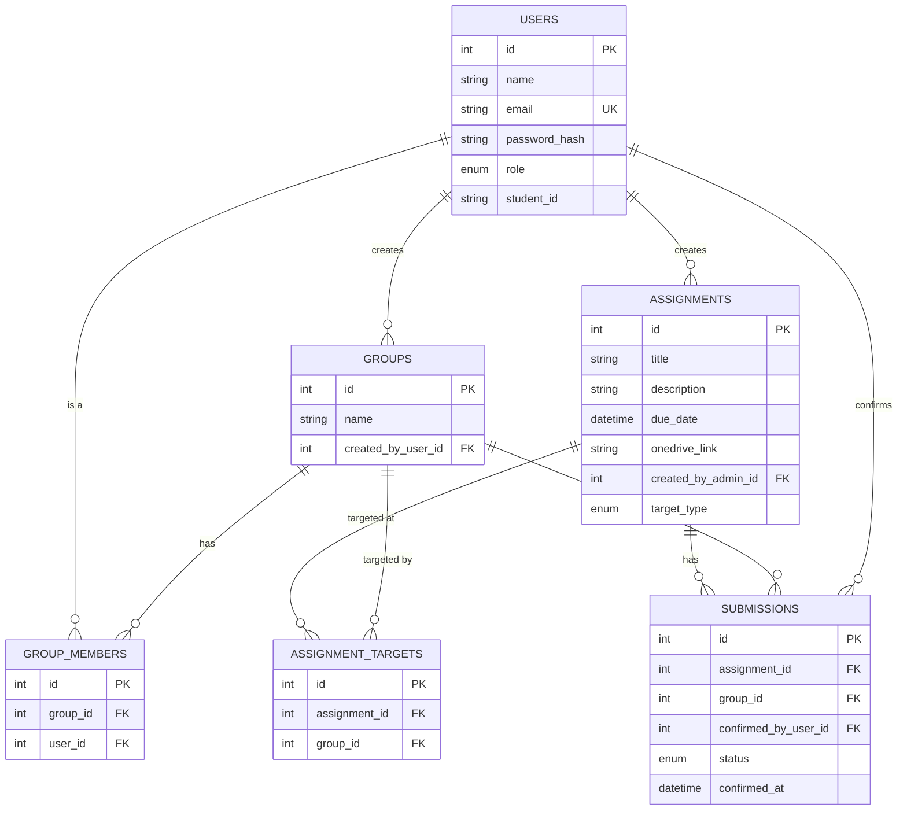
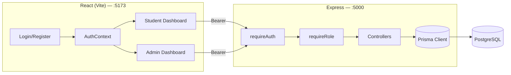

# Joineazy — Student, Group & Assignment Management System

A full-stack web app where students form groups, admins post assignments (to everyone or to specific groups), and students confirm submission through a two-step verification flow. Admins get a live tracker and completion analytics per group.

Built as a timed take-home task (Task 1).

## Overview

Two roles, one app:

- **Students** register, create or join a group, see the assignments visible to them (either broadcast to everyone or targeted at their group), and confirm submission through a "click once, then confirm" two-step flow to avoid accidental taps.
- **Admins** post and edit assignments, choose whether an assignment goes to everyone or to specific groups, see a submissions tracker broken down by group/student, and view completion analytics across all groups.

Authentication is JWT-based with role-aware middleware, so admin-only and student-only routes are enforced server-side, not just hidden in the UI.

## Tech Stack

| Layer            | Choice                                                       |
| ---------------- | ------------------------------------------------------------ |
| Frontend         | React (Vite), React Router, Tailwind CSS, Axios, Recharts    |
| Backend          | Node.js, Express 5                                           |
| Database         | PostgreSQL                                                   |
| ORM              | Prisma                                                       |
| Auth             | JWT (`jsonwebtoken`) + `bcrypt` password hashing             |
| Containerization | Docker, docker-compose (Postgres + backend + frontend/nginx) |

## Project Structure

```
joineazy-task1/
├── backend/
│   ├── src/
│   │   ├── config/prisma.js
│   │   ├── controllers/       (auth, group, assignment, submission, analytics)
│   │   ├── middleware/        (auth.js — JWT verify, roleCheck.js — role gate)
│   │   ├── routes/
│   │   └── server.js
│   ├── prisma/
│   │   ├── schema.prisma
│   │   └── migrations/
│   └── Dockerfile
├── frontend/
│   ├── src/
│   │   ├── api/                (axios instance + per-resource API modules)
│   │   ├── components/         (forms, tracker, progress bar, confirm modal, etc.)
│   │   ├── context/AuthContext.jsx
│   │   ├── pages/               (Login, Register, StudentDashboard, AdminDashboard)
│   │   └── App.jsx
│   └── Dockerfile
├── docker-compose.yml
└── README.md
```

## Setup & Run

### Option A — Local (npm run dev)

**Backend**

```bash
cd backend
npm install
```

Create `backend/.env`:

```env
PORT=5000
DATABASE_URL=postgresql://<user>:<password>@<host>:5432/<db>
DIRECT_URL=postgresql://<user>:<password>@<host>:5432/<db>
JWT_SECRET=some_long_random_string
JWT_EXPIRES_IN=7d
CLIENT_ORIGIN=http://localhost:5173
```

> `DIRECT_URL` matters if you're on a pooled Postgres provider (e.g. Neon) — Prisma migrations need a direct, non-pooled connection. For a plain local Postgres install, both variables can point to the same URL.

```bash
npx prisma migrate dev     # applies migrations, generates the Prisma client
npm run dev                # http://localhost:5000, nodemon reload
```

Health check: `GET http://localhost:5000/health` → `{ status: 'ok' }`

**Frontend**

```bash
cd frontend
npm install
cp .env.example .env       # VITE_API_URL=http://localhost:5000/api
npm run dev                # http://localhost:5173
```

### Option B — Docker Compose (full stack, one command)

```bash
docker-compose up --build
```

This spins up its own Postgres container (separate from any cloud DB you use for local dev), builds the backend image (runs `prisma migrate deploy` on container start), and builds the frontend into a static bundle served by nginx.

- Frontend: `http://localhost:5173`
- Backend: `http://localhost:5000`
- Postgres: `localhost:5432` (`joineazy_user` / `joineazy_pass` / `joineazy_db`)

> The compose file hardcodes a placeholder `JWT_SECRET` — fine for local/demo use, but swap it out before deploying anywhere real.

## API Reference

All endpoints are prefixed with `/api`. Protected routes require `Authorization: Bearer <token>`.

### Auth — `/api/auth`

| Method | Path        | Auth   | Body                                      | Response                                                       |
| ------ | ----------- | ------ | ----------------------------------------- | -------------------------------------------------------------- | --------------------------------------------------------------------------------------- |
| POST   | `/register` | —      | `{ name, email, password, role: 'student' | 'admin', student_id? }` (required for students)                | `201` `{ token, user }` · `400` invalid/missing fields · `409` email already registered |
| POST   | `/login`    | —      | `{ email, password }`                     | `200` `{ token, user }` · `401` invalid credentials            |
| GET    | `/me`       | ✅ any | —                                         | `200` `{ user }` — used to validate a stored token on app load |

### Groups — `/api/groups`

| Method | Path            | Auth     | Body                                       | Response                                                                                                 |
| ------ | --------------- | -------- | ------------------------------------------ | -------------------------------------------------------------------------------------------------------- |
| GET    | `/`             | ✅ admin | —                                          | `200` `{ groups }` — every group in the system, with members                                             |
| POST   | `/`             | ✅ any   | `{ name }`                                 | `201` `{ group }` — creator is auto-added as the first member                                            |
| POST   | `/:id/members`  | ✅ any   | `{ identifier }` (email **or** student ID) | `201` `{ member }` · `403` you're not in this group · `404` no matching student · `409` already a member |
| GET    | `/mine`         | ✅ any   | —                                          | `200` `{ groups }` — groups the current user belongs to                                                  |
| GET    | `/:id/progress` | ✅ any   | —                                          | `200` `{ groupId, total, confirmed, percentage }` · `403` if not a member (admins exempt)                |

### Assignments — `/api/assignments`

| Method | Path               | Auth     | Body                                                                 | Response                                                                                                                                                                            |
| ------ | ------------------ | -------- | -------------------------------------------------------------------- | ----------------------------------------------------------------------------------------------------------------------------------------------------------------------------------- | ----------------------------------------------------------------------------------------------------- |
| GET    | `/`                | ✅ any   | —                                                                    | Role-aware: admins get every assignment + targeting info; students get only assignments visible to them (`all`, or targeted at their group), each annotated with `submissionStatus` |
| POST   | `/`                | ✅ admin | `{ title, description?, due_date, onedrive_link, target_type?: 'all' | 'group', group_ids? }`                                                                                                                                                              | `201` `{ assignment }` · `400` missing required fields, or missing `group_ids` when targeting a group |
| PUT    | `/:id`             | ✅ admin | any subset of `{ title, description, due_date, onedrive_link }`      | `200` `{ assignment }`                                                                                                                                                              |
| GET    | `/:id/submissions` | ✅ admin | —                                                                    | `200` `{ assignmentId, groups: [{ groupId, groupName, status, confirmedAt, members }] }` — group-wise **and** student-wise status in one payload                                    |

### Submissions — `/api/submissions`

| Method | Path                     | Auth       | Body           | Response                                                                                                                         |
| ------ | ------------------------ | ---------- | -------------- | -------------------------------------------------------------------------------------------------------------------------------- |
| POST   | `/:assignmentId/confirm` | ✅ student | `{ group_id }` | `200` `{ submission }` · `403` not a member of that group, or assignment not targeted at that group · `404` assignment not found |

> **Two-step confirm:** the spec's "step 1 / step 2" is implemented as a single API call, with the two-step UX handled entirely in the frontend (`ConfirmSubmissionModal.jsx`) — clicking "Yes, I have submitted" opens a modal, and only clicking "Confirm" inside it actually fires the request. This was a deliberate scope call under the time budget (an explicitly allowed shortcut in the original plan) since it satisfies the requirement's intent — preventing accidental one-click submissions — without a second network round trip.

### Analytics — `/api/analytics`

| Method | Path        | Auth     | Body | Response                                                                                                                                 |
| ------ | ----------- | -------- | ---- | ---------------------------------------------------------------------------------------------------------------------------------------- |
| GET    | `/overview` | ✅ admin | —    | `200` `{ totalAssignments, totalGroups, overallCompletionPercentage, perGroup: [{ groupId, groupName, total, confirmed, percentage }] }` |

**Common error shape:** `{ "message": "..." }` on all `4xx`/`5xx` responses.

## Database / ER Diagram



**Relationships, in plain terms:**

- A **user** is either a `student` or an `admin`. Students carry a `student_id`; admins don't.
- A **group** is created by one student, who is automatically its first member. `group_members` is a join table (`user` ⇄ `group`, many-to-many) with a `unique(group_id, user_id)` constraint so no one joins the same group twice.
- An **assignment** belongs to one admin and has a `target_type` of either `all` (visible to every group) or `group`. When it's `group`-targeted, `assignment_targets` records exactly which groups it's visible to — this is what lets one assignment fan out to several specific groups without duplicating rows.
- A **submission** is one row per `(assignment, group)` pair (enforced by a `unique` constraint) — submission is a group action, not a per-student one, matching the fact that groups submit assignments together. It starts implicitly `pending` and flips to `confirmed` (with a timestamp and who confirmed it) via the two-step confirm flow.

## Architecture Overview



**JWT flow:**

1. `POST /api/auth/register` or `/login` hashes/verifies the password with `bcrypt`, then signs a JWT containing `{ id, role }` (`jsonwebtoken`, default 7-day expiry).
2. The frontend stores the token in `localStorage` (`AuthContext.jsx`) and an Axios request interceptor (`api/axios.js`) attaches it as `Authorization: Bearer <token>` on every outgoing request.
3. On the backend, `requireAuth` middleware verifies the token and attaches the decoded payload to `req.user`; `requireRole('admin'|'student')` then gates specific routes based on `req.user.role`.
4. An Axios response interceptor watches for `401`s and clears the stored token/user, bouncing the app back to a logged-out state — so an expired or tampered token doesn't leave the UI in a broken half-authenticated state.

## Key Design Decisions

- **Prisma over raw SQL** — chosen for migration speed and type-safe queries under the time constraint, at the cost of a bit more abstraction over the actual SQL.
- **Two-step confirm is client-side only** — one API endpoint (`POST /submissions/:assignmentId/confirm`), with the "are you sure?" step handled entirely in a modal component before the request ever fires. Satisfies the UX/security intent without a second endpoint.
- **Submissions are per-group, not per-student** — matches the domain: a group submits an assignment together, and any member confirming it should update status for the whole group. Enforced with a DB-level `unique(assignment_id, group_id)` constraint plus an `upsert` in the controller, so confirming twice is a safe no-op rather than a duplicate row or a crash.
- **`assignment_targets` as a join table instead of a `group_id` column on `assignments`** — lets a single assignment target multiple groups (not just one), which the "broadcast to everyone or to specific groups" requirement needed.
- **Email format validation added late, on top of already-working duplicate-email checks** — the backend now rejects malformed emails (`name@domain.tld` pattern) before hitting the database on both register and login, so a bad email shows a clear message instead of a confusing 500.

## Known Limitations

- JWTs are stored in `localStorage` rather than an HTTP-only cookie — simpler for a timed project, but more exposed to XSS than a cookie-based session would be.
- No email verification or password-reset flow — out of scope for the task timeline.
- No rate limiting on `/auth/login` or `/auth/register`.
- `docker-compose.yml` ships a placeholder `JWT_SECRET` for convenience — must be replaced with a real secret before any non-local deployment.
- The analytics `overview` endpoint recomputes completion stats on every request rather than caching — fine at this data scale, would need revisiting for a large number of groups/assignments.
