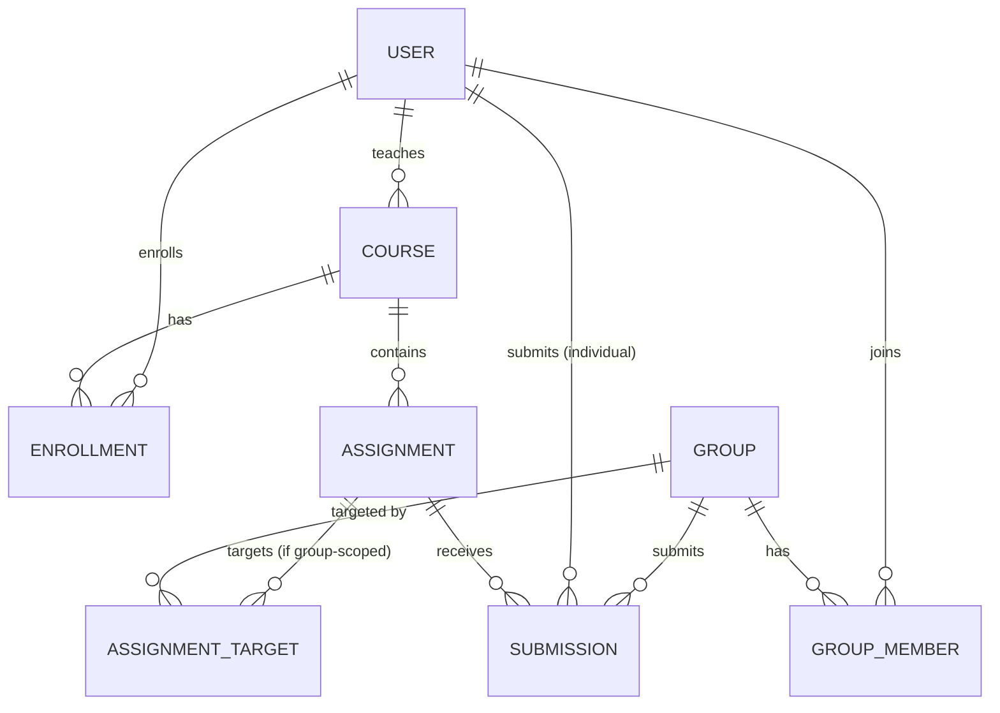
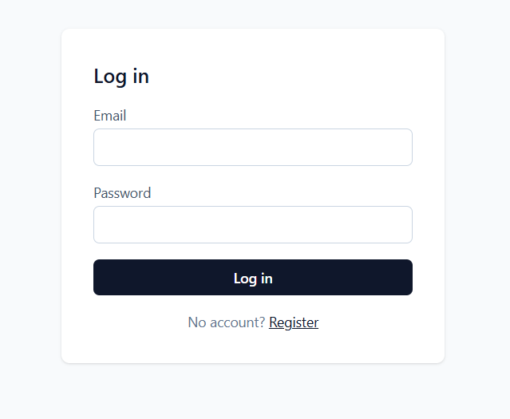
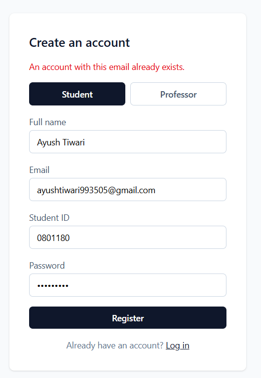
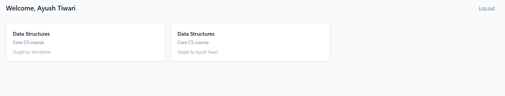
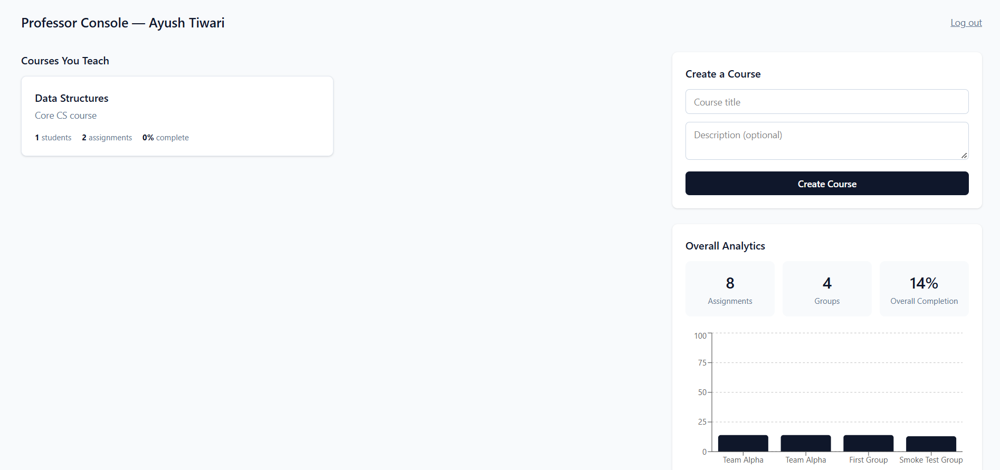
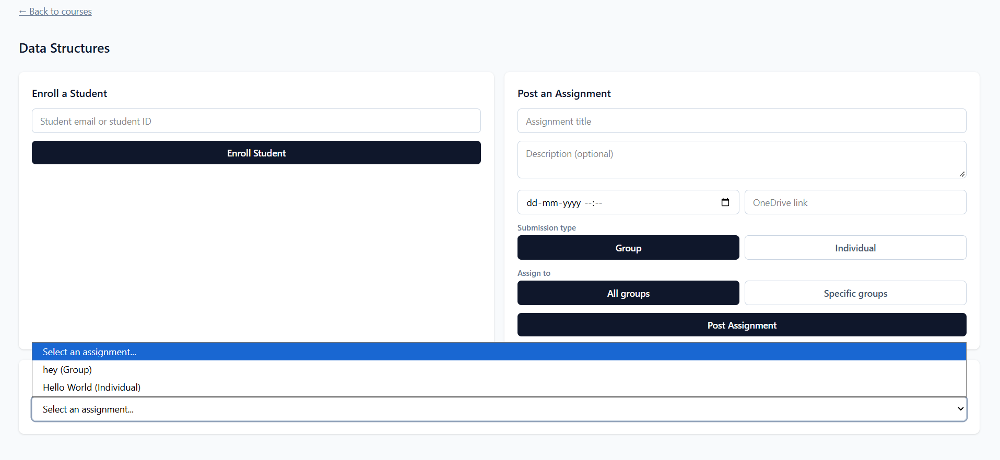

# Joineazy — Student, Group & Assignment Management System (Round 2)

A full-stack course/assignment platform where professors run courses and post assignments, and students enroll, form groups, and confirm submissions — individually or as a group, with leader-only acknowledgment for group work.

**Live demo:** https://joineazy-task1-beta.vercel.app
**Backend API:** https://joineazy-task1-xa6a.onrender.com

> Note: the backend runs on Render's free tier, which spins down after inactivity. The first request after idle time may take 30-50 seconds to respond while it wakes up — this is expected, not a bug.

---

## 1. UI/UX Design Choices

- **Course-card grid on the student dashboard** — students often juggle multiple courses at once, so a responsive grid (1 column on mobile, up to 3 on desktop) was chosen over a flat list, letting students visually scan and jump into a course in one click.
- **Two-step submission confirmation** ("Yes, I have submitted" → confirmation modal → "Confirm") — submission confirmation is irreversible and affects the whole group, so a single accidental click shouldn't trigger it. The extra step is a deliberate friction point for a consequential action.
- **Leader-only gating on group assignments** — rather than silently allowing any member to confirm (which could cause conflicting or premature confirmations), non-leaders see a clear "Waiting on group leader to confirm" message instead of a disabled button, so the reason is explicit rather than mysterious.
- **Individual vs. group badges on every assignment** — since the two submission types have different rules (who can confirm, what "progress" means), the badge is shown right on the assignment card so the distinction is never ambiguous to the student.
- **Status badges (Pending/Confirmed) with color coding** — amber for pending, emerald for confirmed — gives an at-a-glance read of submission state without requiring the student to read text.

## 2. Architecture Overview

```
React (Vite) + Tailwind  ⇄  Express REST API  ⇄  PostgreSQL (Neon)
     (Vercel)                   (Render)              (Neon cloud)
```

- **Frontend:** React 19, Vite, Tailwind CSS v4, React Router for client-side routing, Axios for API calls with a JWT-attaching interceptor.
- **Backend:** Node.js + Express, Prisma ORM, JWT-based auth with role middleware (`student` / `admin`), bcrypt password hashing.
- **Database:** PostgreSQL, hosted on Neon (serverless Postgres) — uses a pooled connection string for normal runtime queries and a direct connection string for migrations, per Neon + Prisma's recommended setup.
- **Deployment:** Backend containerized with Docker, deployed on Render (rebuilds Prisma client + runs migrations on every deploy). Frontend built as a static Vite bundle, deployed on Vercel.

## 3. Database Schema

Key models (see `backend/prisma/schema.prisma` for the full source of truth):

- **User** — `role` (student/admin), auth fields, student ID
- **Course** — owned by a professor (`professorId`)
- **Enrollment** — join table: which students are in which course
- **Group** / **GroupMember** — student-formed groups; `GroupMember.isLeader` marks who can confirm on the group's behalf
- **Assignment** — scoped to a `courseId`, has a `submissionType` (`individual` | `group`) and a `targetType` (`all` | `group`, for group-type assignments targeted at specific groups)
- **Submission** — polymorphic on purpose: either `groupId` (group-type) or `studentId` (individual-type) is set, never both, tracked via a `status` (`pending` | `confirmed`)



## 4. API Endpoints

| Method | Endpoint | Role | Description |
|---|---|---|---|
| POST | `/api/auth/register` | Public | Register (student or admin) |
| POST | `/api/auth/login` | Public | Log in, returns JWT |
| GET | `/api/auth/me` | Both | Current user's profile |
| GET | `/api/courses` | Both | Student: enrolled courses. Admin: courses taught (with student/assignment counts + completion %) |
| POST | `/api/courses` | Admin | Create a course |
| POST | `/api/courses/:id/enroll` | Admin | Enroll a student by email or student ID |
| POST | `/api/groups` | Student | Create a group (creator becomes leader) |
| POST | `/api/groups/:id/members` | Student | Add a member by email or student ID |
| GET | `/api/groups/mine` | Student | Student's own group(s) |
| GET | `/api/groups/:id/progress` | Student/Admin | Group's overall completion % |
| GET | `/api/groups` | Admin | All groups (for assignment targeting) |
| GET | `/api/assignments?course_id=` | Both | List assignments (student: with submission status; admin: with targeting info) |
| POST | `/api/assignments` | Admin | Create assignment (course-scoped, individual/group type) |
| PUT | `/api/assignments/:id` | Admin | Edit an assignment |
| GET | `/api/assignments/:id/submissions` | Admin | Per-group or per-student submission breakdown |
| POST | `/api/submissions/:assignmentId/confirm` | Student | Confirm submission (leader-gated for group type) |
| GET | `/api/analytics/overview` | Admin | System-wide completion stats |

## 5. Setup Instructions

### Prerequisites
- Node.js 20+
- A PostgreSQL database (this project uses [Neon](https://neon.tech), free tier)
- Docker Desktop (optional, only needed for the containerized setup)

### Backend
```bash
cd backend
cp .env.example .env   # fill in DATABASE_URL, DIRECT_URL, JWT_SECRET
npm install
npx prisma generate
npx prisma migrate deploy
npm run dev             # http://localhost:5000
```

### Frontend
```bash
cd frontend
npm install
npm run dev              # http://localhost:5173
```
Set `VITE_API_URL` in a `.env` file if your backend isn't on `http://localhost:5000/api`.

### Docker (full local stack, own Postgres container)
```bash
docker-compose up --build
```
Runs Postgres + backend + frontend together, self-contained — no cloud DB needed.

## 6. Known Limitations

- **Group progress is global, not per-course.** The `/api/groups/:id/progress` endpoint reports a group's completion across *all* assignments it's been targeted by, not scoped to the course currently being viewed. Fixing this would require adding a `course_id` filter to that query — flagged as a follow-up, not implemented due to time constraints this round.
- **A student is assumed to belong to one primary group** for leader-check purposes. If a student is in multiple groups, leader status is evaluated as "is leader of *any* group," not per-group.
- **Free-tier hosting cold starts.** The Render backend sleeps after ~15 minutes of inactivity; the first request afterward is slow.

## 7. Screenshots

### Login


### Register


### Student Dashboard — Course Grid


### Professor Dashboard — Courses Taught


### Professor — Course Detail (Enroll Student / Post Assignment / Submissions Tracker)


---

## Repository Structure
```
joineazy-task1/
├── backend/    — Express API, Prisma schema, JWT auth
├── frontend/   — React + Vite + Tailwind
├── docker-compose.yml
└── docs/screenshots/  — UI screenshots referenced above
```
